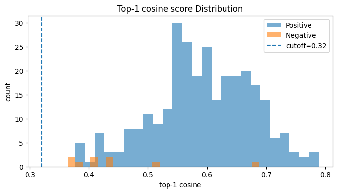

# Project Description
구현 아키텍처 및 접근 방식에 관한 설명입니다.

## 1. 데이터 전처리

데이터 전처리는 편의상 Google Colab 환경에서 처리했다.

```python
from datasets import load_dataset

dataset = load_dataset("squad_kor_v1")
```

```
DatasetDict({
    train: Dataset({
        features: ['id', 'title', 'context', 'question', 'answers'],
        num_rows: 60407
    })
    validation: Dataset({
        features: ['id', 'title', 'context', 'question', 'answers'],
        num_rows: 5774
    })
})
```

### 결측치 처리
```python
import pandas as pd

df = pd.DataFrame(dataset['train'])

cols = ['id', 'title', 'context', 'question', 'answers']

null_df = df[cols].isna().any(axis=1)
null_exit = bool(null_df.any())
null_count = int(null_df.sum())

print(null_exit)
print(null_count)
```

```
False
0
```
결측치를 확인한 결과 결측치는 발견되지 않았다.

### 정규화 및 중복 제거
dataset을 살펴보면 벡터화에 필요하지 않은 내용들이 있어 우선 정규화를 통한 삭제 혹은 대체했다.<br/>

#### **정규화**
유니코드 NFC로 통일하여 정규화 했으며 NBSP→공백, 인용부호와 대시(dash)는 통일, 제어문자 제거, 다중 공백 축소 등을 통해 정규화했다.

#### **각주**

```
...인도의 안보상의 이유에서[15]티베트에 침략을 개시했다. 또한 일본인으로서...

...이슬람 선교의 개척자 새뮤얼 즈웨머(Samuel Zwemer)[1], 기독교청년회(YMCA) 운동과...

...인터뷰에서 이재진은 다음과 같이 말했다.[21]. 원문: 그런 이미지 때문에...
```

해당 예시들의 경우 context 내에서 전혀 의미가 없는 내용이므로 삭제했다.

#### **동그라미 숫자**

```
...계약의 성립에는 다섯 가지 핵심 요소(① 청약과 승낙, ② 약인(約因) ③ 법률 관계를...

...공약10조는 ① 천하의 정의(正義)의 사(事)를 맹렬히 실행하기로 함. ② 조선의 독립과 세계의...

...여기에서 ① “약속이나 합의”는 적어도 두 당사자, 즉 약속자와 수락자의 존재를 필요로...
```

해당 동그라미 숫자(`①`, `②`, `③` ...)는 대게 목차, 순서 정보라 의미가 있으며 토크나이저에선 희귀 문자이기 때문에 임베딩 품질에 잡음이 생길 위험이 있다. 따라서 숫자 + 구두점 (`1.`, `2.`, `3.` ...)으로 대체하여 의미도 살리고 토큰화에도 이점을 살렸다.

#### **중복 제거**

|id|title|context|question|answers|
|--|--|--|--|--|
|6566495-0-0|파우스트_서곡|1839년 바그너는 괴테의 파우스트을 처음 읽고 그 내용에 마음이 끌려 이를 소재로...|바그너는 괴테의 파우스트를 읽고 무엇을 쓰고자 했는가?|{'text': ['교향곡'], 'answer_start': [54]}|
|6566495-0-1|파우스트_서곡|1839년 바그너는 괴테의 파우스트을 처음 읽고 그 내용에 마음이 끌려 이를 소재로...|바그너는 교향곡 작곡을 어디까지 쓴 뒤에 중단했는가?|{'text': ['1악장'], 'answer_start': [421]}|
|6566495-0-2|파우스트_서곡|1839년 바그너는 괴테의 파우스트을 처음 읽고 그 내용에 마음이 끌려 이를 소재로...|바그너가 파우스트 서곡을 쓸 때 어떤 곡의 영향을 받았는가?|{'text': ['베토벤의 교향곡 9번'], 'answer_start': [194]}|
|6566518-0-0|파우스트_서곡|1839년 바그너는 괴테의 파우스트을 처음 읽고 그 내용에 마음이 끌려 이를 소재로...|1839년 바그너가 교향곡의 소재로 쓰려고 했던 책은?|{'text': ['파우스트'], 'answer_start': [15]}|
|...|...|...|...|...|

RAG에서는 context를 주로 활용할 예정이므로 중복된 'context'는 제거했다.

#### **결과**

중복 제거 전 train 개수: 60407<br/>
중복 제거 후 train 개수: 10562

|정규화 전|정규화 후|
|--|--|
|...인도의 안보상의 이유에서[15]티베트에 침략을 개시했다. 또한 일본인으로서...|...인도의 안보상의 이유에서 티베트에 침략을 개시했다. 또한 일본인으로서...|
|...이슬람 선교의 개척자 새뮤얼 즈웨머(Samuel Zwemer)[1], 기독교청년회(YMCA) 운동과...|...이슬람 선교의 개척자 새뮤얼 즈웨머(Samuel Zwemer) , 기독교청년회(YMCA) 운동과...|
|...인터뷰에서 이재진은 다음과 같이 말했다.[21]. 원문: 그런 이미지 때문에...|... 인터뷰에서 이재진은 다음과 같이 말했다. . 원문: 그런 이미지 때문에...|
|...계약의 성립에는 다섯 가지 핵심 요소(① 청약과 승낙, ② 약인(約因) ③ 법률 관계를...|...계약의 성립에는 다섯 가지 핵심 요소(1. 청약과 승낙, 2. 약인(約因) 3. 법률 관계를...|
|...공약10조는 ① 천하의 정의(正義)의 사(事)를 맹렬히 실행하기로 함. ② 조선의 독립과 세계의...|...공약10조는 1. 천하의 정의(正義)의 사(事)를 맹렬히 실행하기로 함. 2. 조선의 독립과 세계의...|
|...여기에서 ① “약속이나 합의”는 적어도 두 당사자, 즉 약속자와 수락자의 존재를 필요로...|...여기에서 1. "약속이나 합의"는 적어도 두 당사자, 즉 약속자와 수락자의 존재를 필요로...|

## 2. 청크 설계
청크 처리는 편의상 Google Colab 환경에서 처리했다.<br/>
<br/>
청크는 검색 시 문맥 밀도를 올리면서 환각을 줄이는 역할을 한다.<br/>
너무 짧으면 문맥 손실이 있으며 너무 길면 검색 정밀도가 저하되므로 480자에 stride 120자로 설정했다.<br/>
<br/>
평균 청크 길이: 430.15906915089477

## 3. 벡터 임베딩
벡터 임베딩은 GPU 활용이 가능한 Google Colab 환경에서 처리했다.<br/>
<br/>

모델은 HuggingFace에서 `dragonkue/snowflake-arctic-embed-l-v2.0-ko`를 사용했다. 모델의 크기가 568M으로 가볍고 한국어로 최적화 된 모델 중 벤치마크 성능이 좋다. [참고](https://huggingface.co/dragonkue/snowflake-arctic-embed-l-v2.0-ko)

### 문서 임베딩

```python
from sentence_transformers import SentenceTransformer
import numpy as np
import pandas as pd

st = SentenceTransformer("dragonkue/snowflake-arctic-embed-l-v2.0-ko")

def embed_corpus(chunks_path, out_vec_path, out_meta_path, batch_size=64):

    ch = pd.read_parquet(chunks_path)
    texts = ch["norm_text"].tolist()

    vecs = st.encode(texts, batch_size=batch_size, normalize_embeddings=True, show_progress_bar=True)
    vecs = vecs.astype("float32")

    meta = ch[["doc_id","title","chunk_id", "context_preview","norm_len"]].copy()
    meta["row_id"] = np.arange(len(meta))

    np.save(out_vec_path, vecs)
    meta.to_parquet(out_meta_path, index=False)

    return vecs, meta
```

앞서 청크 설계에서 만든 임베딩 입력용 텍스트를 읽어와 배치 단위로 텍스트를 벡터화하는 과정이다.<br/>
<br/>
`vecs`: 청크 임베딩 행렬
`meta`: 검색 결과를 렌더링할 때 필요한 출처 필드들(문서ID, 제목, 청크ID, 미리보기, norm) <br/>

### 인덱싱

인덱싱은 FAISS를 사용했다.

```
!pip install faiss-gpu-cu12
```

Colab 환경에서 사용하며, 현재 `pip install faiss-gpu` 명령어로 설치하면 해당 버전을 찾을 수 없다는 오류가 나오므로 뒤에 꼭 `-cu12`를 설치해야 사용 가능하다.

```python
import faiss
import numpy as np
import pandas as pd

vecs = np.load(VEC_PATH).astype("float32")
meta = pd.read_parquet(META_PATH)
chunks_df = pd.read_parquet(CHUNKS_PATH)

index = faiss.IndexFlatIP(vecs.shape[1])
index.add(vecs)

faiss.write_index(index, INDEX_PATH)
```

인덱싱 결과: ntotal=13579, dim=1024 <br/>

인덱싱한 것을 바탕으로 메타 정보가 담겨있는 `META_PATH`, 인덱싱(벡터) 정보가 담겨있는 `INDEX_PATH`를 활용하여 이후에 RAG를 구성하면 된다.

#### 문서 검색 결과

데이터 예시인 아래를 참고하려 했으나 `squad_kor_v1`에 존재하지 않아 다른 내용으로 결과를 확인했다.

```python
from datasets import load_dataset
import pandas as pd
import numpy as np

dataset = load_dataset("squad_kor_v1")
df = pd.DataFrame(dataset['train'])

id_df = df[df['id'] == '656656-0-0']
title_df = df[df['title'] == '유엔']

print(len(id_df))
print(len(title_df))
```

```
0
0
```

따라서 "바그너는 괴테의 파우스트를 읽고 무엇을 쓰고자 했는가?"에 대해 Search한 내용을 바탕으로 서술했다.<br/>

|id|title|context|question|answers|
|--|--|--|--|--|
|6566495-0-0|파우스트_서곡|1839년 바그너는 괴테의 파우스트을 처음 읽고 그 내용에 마음이 끌려 이를 소재로...|바그너는 괴테의 파우스트를 읽고 무엇을 쓰고자 했는가?|{'text': ['교향곡'], 'answer_start': [54]}|

```
{'hits': [{'score': 0.6594024300575256,
   'title': '파우스트_서곡',
   'doc_id': 'ac553d99e719eee27dfa683ca05d3f54',
   'chunk_id': 0,
   'preview': '1839년 바그너는 괴테의 파우스트을 처음 읽고 그 내용에 마음이 끌려 이를 소재로 해서 하나의 교향곡을 쓰려는 뜻을 갖는다. 이 시기 바그너는 1838년에 빛 독촉으로 산전수전을 다 걲은 상황이라 좌절과 실망에 가'},
  {'score': 0.48801860213279724,
   'title': '파우스트_서곡',
   'doc_id': 'bc2fb387e8d8e9ddd7e82f65013f4465',
   'chunk_id': 0,
   'preview': '한편 1840년부터 바그너와 알고 지내던 리스트가 잊혀져 있던 1악장을 부활시켜 1852년에 바이마르에서 연주했다. 이것을 계기로 바그너도 이 작품에 다시 관심을 갖게 되었고, 그 해 9월에는 총보의 반환을 요구하여'},
  {'score': 0.484121710062027,
   'title': '프리드리히_니체',
   'doc_id': 'cc702fed6bc38930aa61190890b75e5a',
   'chunk_id': 0,
   'preview': '1873년과 1876년 사이에는 《반시대적 고찰》을 썼는데, 총 4편으로 《다비드 슈트라우스, 고백자와 저술가》, 《삶에 대한 역사의 공과》, 《교육자로서의 쇼펜하우어》,《바이로이트의 리하르트 바그너》로 나뉜다. 네'},
  {'score': 0.42433544993400574,
   'title': '교향곡_다장조_(바그너)',
   'doc_id': 'cb2a66cce804393b149ae70b1e1085d2',
   'chunk_id': 0,
   'preview': '바그너라고 하면, 흔히 오페라 등의 무대 작품 또는 그 작품에서 거의 독립된 형태로 자주 연주되는 서곡이나 전주곡을 떠놀리게 된다. 이것은 그의 피아노 소나타와 현악4중주 등의 순수한 기악곡이 거의 잊혀져가고 있는 '},
  {'score': 0.4117482304573059,
   'title': '바이로이트_축제',
   'doc_id': '29e68c4c50b71c489c663501251788be',
   'chunk_id': 0,
   'preview': '축제는 일단 시작되기만 한다면 바이로이트의 가장 중요한 문화행사가 될 것이었다. 1870년 4월에 바그너와 그의 아내 코지마(Cosima)는 바이로이트를 방문해 오페라하우스를 조사했으나, 축제에는 적합하지 않은 것으'}]}
```

Score가 `0.6594024300575256`으로 원문 "1839년 바그너는 괴테의 파우스트을 처음 읽고 그 내용에 마음이 끌려 이를 소재로..."를 잘 찾는 결과를 보여준다.

## 4. RAG 구현

RAG의 경우 질문 임베딩 → 검색 → 컨텍스트 구성 → 프롬프트 빌드 → 답변 생성 순으로 진행된다.

```python
st = SentenceTransformer("dragonkue/snowflake-arctic-embed-l-v2.0-ko")
index = faiss.read_index(INDEX_PATH)
meta = pd.read_parquet(META_PATH)
chunks_df = pd.read_parquet(CHUNKS_PATH)
```

### 질문 임베딩

```python
def embed_query(q: str) -> np.ndarray:
    try:
        v = st.encode([q], normalize_embeddings=True, prompt_name="query")[0]
    except TypeError:
        v = st.encode([f"query: {q}"], normalize_embeddings=True)[0]
    return v.astype("float32")
```

질문 임베딩 또한 `dragonkue/snowflake-arctic-embed-l-v2.0-ko`을 활용하여 임베딩을 한 뒤 유사도를 검색했다.

### 검색

```python
def search(q: str, topk=5):
    qv = embed_query(q)
    D, I = index.search(qv[None, :], topk)
    rows = []
    for s, idx in zip(D[0], I[0]):
        m = meta.iloc[int(idx)]
        rows.append({
            "row_id": int(idx),
            "score": float(s),
            "title": m["title"],
            "doc_id": m["doc_id"],
            "chunk_id": int(m["chunk_id"])
        })
    return rows
```

### 컨텍스트 구성

컨텍스트 블록은 언어 모델이 참고할 내용으로 검색에서 가져 온 내용을 활용해서 구성했다.

```python
def get_chunk_text(doc_id, chunk_id, prefer="context"):
    row = chunks_df[(self.chunks_df["doc_id"]==doc_id) & (self.chunks_df["chunk_id"]==int(chunk_id))]
    if row.empty:
        return ""
    for col in [prefer, "norm_text", "context", "text"]:
        if col in row.columns:
            val = row.iloc[0][col]
            if val is not None:
                return str(val)
    return ""
```

```python
def build_context_blocks(hits, k_ctx=5, min_score=0.0, max_chars=500):
    blocks, sources, used_chunk = [], [], []
    if not hits:
        return blocks, sources, used_chunk, 0.0

    for h in hits[:k_ctx]:
        if h.get("score", 1.0) < min_score:
            continue
        chunk = get_chunk_text(h["doc_id"], h["chunk_id"], prefer="context")
        snippet = (chunk or "").replace("\n", " ").strip()[:max_chars]
        blocks.append(snippet)
        sources.append(f'{h.get("row_id",0)}: {h.get("title","")}#{h.get("chunk_id",0)}')
        used_chunk.append(chunk or "")

    seen, uniq = set(), []
    for s in sources:
        if s not in seen:
            seen.add(s); uniq.append(s)
    
    return blocks, uniq, used_chunk, top1_score
```

`blocks`는 실제 모델이 참고할 내용이다.<br/>
`sources`는 출처 중복 제거 및 순서보존, 모델의 메타 데이터를 보기 위해 로그용으로 남겨놨다.<br/>
`used_chunks`는 모델이 참고한 내용을 추후에 확인할 수 있도록 남겨놨다.<br/>
`top_score`는 추후 질의 범위 제한 메커니즘을 구현하기 위해 사용한다.

### 언어 모델 선택

```python
GEN_MODEL = "Qwen/Qwen3-4B-Instruct-2507"
tok = AutoTokenizer.from_pretrained(GEN_MODEL, use_fast=True)
model = AutoModelForCausalLM.from_pretrained(
    GEN_MODEL,
    dtype=torch.float16 if torch.cuda.is_available() else torch.float32,
    device_map="auto",
)
```

모델의 크기가 작으면서 한국어의 이해도가 높은 것으로 나타나는 Qwen3의 4B를 선택했다. [참고](https://huggingface.co/Qwen/Qwen3-4B-Instruct-2507)

### 프롬프트 구성

```python
SYSTEM = (
    "당신은 한국어 RAG 어시스턴트입니다. 제공된 근거(context)만 사용해 사실적으로 답하세요. "
    "근거에 없으면 '제공된 문서에 정보가 없습니다.'라고 한 줄로만 답하세요."
)
```

```python
def build_prompt(question, ctx_blocks):
    user = (
        "[문서들]\n" + "\n".join(f"- {b}" for b in ctx_blocks) + "\n\n"
        "[질문]\n" + question + "\n\n"
        "[출력 지침]\n- 한 줄로만 답하세요. 추가 설명/머리말/코드블록 금지."
    )
    return tok.apply_chat_template(
        [{"role":"system","content":SYSTEM},
         {"role":"user","content":user}],
        tokenize=False, add_generation_prompt=True
    )
```

프롬프트는 위와 같이 구성했다.

### 답변 구성

```python
def generate_answer(self, question, ctx_blocks, temperature=0.2, max_new_tokens=128):
    prompt = build_prompt(question, ctx_blocks)
    inputs = tok(prompt, return_tensors="pt").to(self.model.device)
    with torch.no_grad():
        out = model.generate(
            **inputs, do_sample=True, temperature=temperature, top_p=0.9,
            max_new_tokens=max_new_tokens, eos_token_id=self.tok.eos_token_id,
        )
    gen_ids = out[0][inputs["input_ids"].shape[-1]:]
    text = tok.decode(gen_ids, skip_special_tokens=True).strip()
    return text.splitlines()[0].strip() if text else "제공된 문서에 정보가 없습니다."
```

### 질의 범위 제한 메커니즘

컨텍스트 개수와 cut off가 되는 cosine 유사도는 아래와 같이 정했다. 가져올 컨텍스트 개수를 7, 5, 3 개로 설정하여 `squad_kor_v1` 내의 validation set 300개를 추출해 지표를 살펴보았다.

#### **7개 설정**


|t|tp|fp|fn|tn|precision|recall|f1|
|---|---|---|---|---|---|---|---|
|0\.26|292|8|0|0|0\.9733|1\.0|0\.9865|
|0\.28|292|8|0|0|0\.9733|1\.0|0\.9865|
|0\.3|292|8|0|0|0\.9733|1\.0|0\.9865|
|0\.32|292|8|0|0|0\.9733|1\.0|0\.9865|
|0\.34|292|8|0|0|0\.9733|1\.0|0\.9865|
|0\.36|292|8|0|0|0\.9733|1\.0|0\.9865|
|0\.38|290|5|2|3|0\.9830|0\.9932|0\.9881|
|0\.4|286|5|6|3|0\.9828|0\.9795|0\.9811|


#### **5개 설정**



|t|tp|fp|fn|tn|precision|recall|f1|
|---|---|---|---|---|---|---|---|
|0\.26|291|9|0|0|0\.97|1\.0|0\.9848|
|0\.28|291|9|0|0|0\.97|1\.0|0\.9848|
|0\.3|291|9|0|0|0\.97|1\.0|0\.9848|
|0\.32|291|9|0|0|0\.97|1\.0|0\.9848|
|0\.34|291|9|0|0|0\.97|1\.0|0\.9848|
|0\.36|291|9|0|0|0\.97|1\.0|0\.9848|
|0\.38|289|6|2|3|0\.9797|0\.9931|0\.9863|
|0\.4|285|6|6|3|0\.9794|0\.9794|0\.9794|

#### **3개 설정**


|t|tp|fp|fn|tn|precision|recall|f1|
|---|---|---|---|---|---|---|---|
|0\.26|286|14|0|0|0\.9533|1\.0|0\.9761|
|0\.28|286|14|0|0|0\.9533|1\.0|0\.9761|
|0\.3|286|14|0|0|0\.9533|1\.0|0\.9761|
|0\.32|286|14|0|0|0\.9533|1\.0|0\.9761|
|0\.34|286|14|0|0|0\.9533|1\.0|0\.9761|
|0\.36|286|14|0|0|0\.9533|1\.0|0\.9761|
|0\.38|284|11|2|3|0\.9627|0\.9930|0\.9776|
|0\.4|282|9|4|5|0\.9691|0\.9860|0\.9775|

#### 결론

검색할 컨텍스트 수는 5개로 정했다. 너무 작으면 정답 근거가 빠질 위험이 크며 너무 많으면 잡음이 증가할 위험이 커지며 토큰 낭비도 심해진다. 실전 4-7B 모델에선 3~5개가 sweet spot 이라고 하며, 실제 측정해본 결과 7개와 5개의 지표 차이가 크지 않았으며 3개로 설정했을 시 precision(모델이 True로 분류한 것 중 실제 True인 것의 비율)이 약간 흔들린 것을 볼 수 있다. 따라서 검색할 컨텍스트 수는 5개로 정했다.<br/>
<br/>
또한 3개의 지표 모두 0.36 이후 지표가 흔들리는 것으로 보아, cutoff는 0.36으로 설정했다.<br/>
<br/>
cutoff가 0.36 미만일 경우 `"제공된 문서에 정보가 없습니다."`로 답변한다. [참고](#답변-구성)

### 최종 모델 사용

```python
def ask(question):
    topk, cutoff, k_ctx, min_score = 5, 0.36, 5, 0.0

    hits = search(question, topk = topk)
    ctx_blocks, sources, used_chunks, top1 = build_context(hits, k_ctx=k_ctx, min_score=min_score)

    if (not hits) or (top1 < cutoff) or (not ctx_blocks):
        return {
            "retrieved_document_id": 0,
            "retrieved_document": "",
            "question": question,
            "answers": "제공된 문서에 정보가 없습니다."
        }

    answer = generator.generate_answer(question, ctx_blocks)

    return {
        "retrieved_document_id": sources[0].split(":")[0],
        "retrieved_document": used_chunks[0],
        "question": question,
        "answers": answer
    }
```

`hits`로 받은 검색 결과가 없거나 `hits`내의 참고할 `context`가 없거나 앞선 [질의 범위 제한 메커니즘](#질의-범위-제한-메커니즘)에 따라 `cutoff`가 0.36 미만이면 "제공된 문서에 정보가 없습니다."라는 결과를 출력한다.